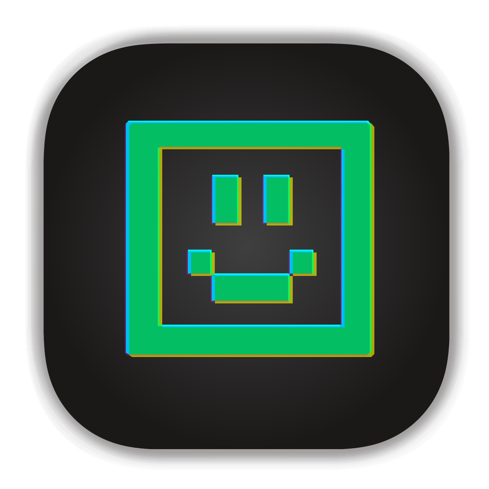
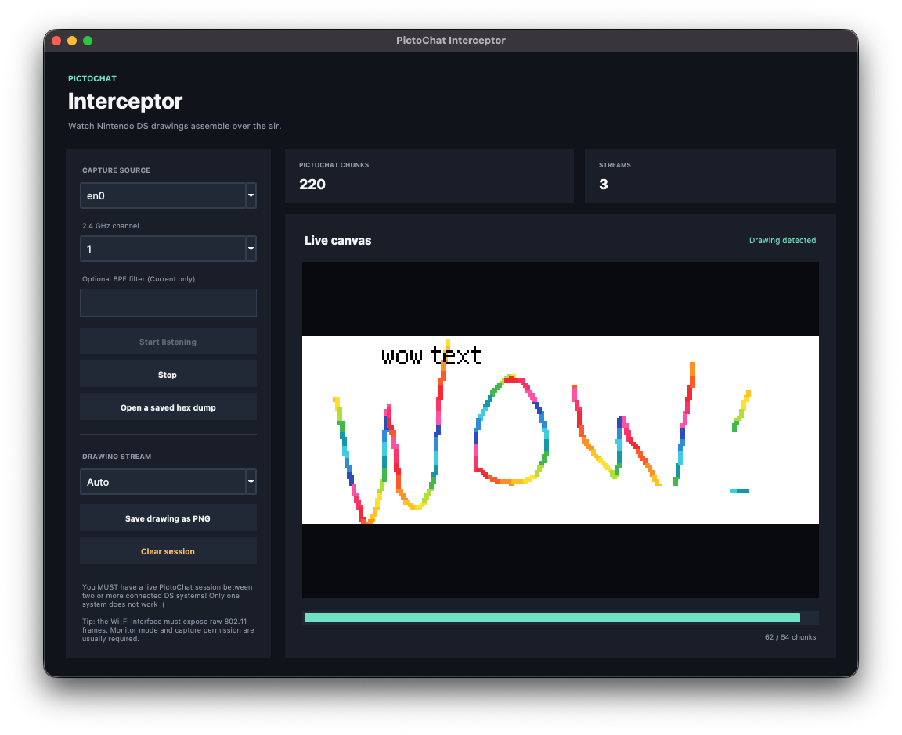

# PictoChat Interceptor



[Download for MacOS (ARM)](https://github.com/PeterWarrington/pictochat-interceptor/releases/download/v0.1/PictoChat-Interceptor-v0.1-ARM64-macOS.zip)

Decode Nintendo DS PictoChat drawings from saved wireless hex dumps or watch them
assemble during a live capture.

The renderer supports normal black ink and the DSi multicolour pen. Rainbow
pixels are encoded as the fixed 4bpp palette indices 3 through 15.

You MUST have a live PictoChat session between two or more connected DS systems! Only one system does not work :(



<details>
<summary><span style="font-weight: bold; font-size: 18pt">The advanced stuff</span></summary>

## Experimental sender GUI

`pictochat_send.py` is the cross-platform companion to the live viewer. It has a
DS-sized drawing surface with black and DSi rainbow-colour pens, image import,
PNG export, packet-capture export, and an experimental raw 802.11 sender:

```sh
.venv/bin/python pictochat_send.py
```

The encoder creates the row-major 4bpp Nintendo tiles and emits the 64 client
upload chunks observed on the air (offsets `0x00a0` through `0x2800`). **Export
packets as PCAP** works on any platform and is the best way to inspect the
result before transmitting. The local encoder can still construct a 65th tail
chunk for lossless codec tests, but that `0x28a0` chunk is not sent by a DS.

Over-the-air sending requires an injection-capable Wi-Fi adapter in monitor
mode, packet privileges, and the correct 2.4 GHz channel. Linux adapters with
monitor/injection support are the most practical route. Apple's built-in macOS
Wi-Fi driver normally supports monitor capture but not raw frame injection, so
Mac users will generally need a compatible external adapter (often passed to a
Linux VM). PictoChat's surrounding NiFi session is request/relay driven.
Airwriter listens for Nintendo beacons to discover the host, uploads the shorter
client-side `56 8e` frames, watches for the host's longer `e6 03` rebroadcasts,
and retries only chunks that were not relayed. The client MAC must belong to a
DS already joined to that room: the available capture starts after association
and does not contain the handshake needed to create a participant from scratch.

Airwriter writes each frame directly through Scapy's layer-2 socket so a BPF or
driver rejection identifies the exact attempt and frame. Detailed errors, errno,
traceback, and the macOS interface state are printed to stderr and shown in a
copyable diagnostic window. A successful write only means the kernel accepted
the bytes; macOS firmware can still discard unsupported injection silently.

### Linux radio setup

Install Tkinter and the standard wireless tools (package names shown for
Debian/Ubuntu), then launch Airwriter with the privileges needed for monitor
mode and raw sockets. `network-manager` is optional; when `nmcli` is already
present, the app tells NetworkManager to stop managing the selected adapter
before changing its mode:

```sh
sudo apt install python3-tk iw iproute2
sudo .venv/bin/python pictochat_send.py
```

Select the USB Wi-Fi interface (usually `wlan0` or `wlan1`), choose the
PictoChat channel, and leave **Configure monitor mode automatically** enabled.
Airwriter runs `nmcli`/`ip`/`iw` without a shell to mark that adapter unmanaged,
bring it down, create a dedicated monitor interface such as `wlan0mon`, bring
that monitor interface up, and tune it. When sending finishes or fails, it
deletes the monitor interface, brings the original adapter up, and hands it back
to NetworkManager when `nmcli` is available. Disable automatic setup if you
already created a monitor interface such as `wlan0mon`.

## Live viewer

Install the two Python dependencies and launch the GUI:

```sh
python3 -m venv .venv
source .venv/bin/activate
python -m pip install -r requirements.txt
.venv/bin/python pictochat_live.py
```

On Windows, install a current 64-bit Python with Tcl/Tk, then use PowerShell:

```powershell
py -m venv .venv
.\.venv\Scripts\Activate.ps1
python -m pip install -r requirements.txt
python pictochat_live.py
```

Live capture on Windows uses Npcap directly through Scapy instead of `tcpdump`.
Install Npcap with its raw 802.11/monitor-mode option enabled and run the viewer
as Administrator. The Wi-Fi adapter and its Windows driver must support monitor
mode, and the adapter must already be tuned to the PictoChat channel; the Windows
UI therefore labels the channel as **Current**. Opening saved hex dumps, decoding,
image import/export, and PCAP export do not require Npcap or administrator access.

On macOS, keep the viewer running as your normal account. When you begin a
fixed-channel capture it opens the standard administrator authentication dialog
for the brief CoreWLAN channel switch only. The GUI is never relaunched as root,
so it retains normal access to Documents and file dialogs. You do not need to
launch it with `sudo` from Terminal.

The Python used to launch the app must include Tkinter. You can check with
`python3 -m tkinter`; it should open a small test window. If Homebrew Python on
macOS reports that `_tkinter` is missing, install the matching `python-tk`
formula for that Python version, then recreate `.venv` and repeat the commands
above. The macOS
system Python at `/usr/bin/python3` also includes Tkinter on many installations,
but Pillow and Scapy must be installed for that same interpreter.

Choose the wireless capture interface and press **Start listening**. The BPF field
is optional; leaving it blank is the safest choice while discovering packets.
You can also open any of the included `test*.txt` captures without elevated
permissions.

On macOS, choose a 2.4 GHz channel in the viewer. The default is channel 1—the
included packet dumps identify themselves as 2412 MHz/channel 1. The viewer
builds a tiny local CoreWLAN helper, uses it to disassociate and retune the
adapter, then streams radiotap frames from Apple's `tcpdump`. This should
disconnect the Mac from its current Wi-Fi network until capture stops. The
**Current** option skips the retune, but only sees the channel already in use by
the Mac. Fixed-channel mode requests administrator authentication for the brief
CoreWLAN retune; capture uses `/dev/bpf*` access. `en0` is normally the built-in
Wi-Fi interface. Apple's Command Line Tools are required once to compile the
helper.

Live 802.11 capture still depends on the wireless adapter and channel. The
interface must receive raw frames in the same radiotap/802.11 layout as the saved
captures. The macOS tcpdump route listens on the adapter's monitor channel; if
the Nintendo DS is using another channel, no PictoChat chunks will appear.
Linux typically requires monitor mode plus root or packet-capture capabilities.
When `nmcli` is available, the viewer also marks the selected adapter unmanaged
while capture is running so NetworkManager does not retune it. Auto-setup
captures through a dedicated monitor interface such as `wlan0mon`, then deletes
that monitor interface and restores the original adapter when capture stops. The
**802.11 frames** counter should increase even before PictoChat chunks are
decoded; if it stays at zero, the adapter is not hearing traffic on that channel.

## Command-line decoder

```sh
python3 pictochat_decode.py --input test.txt --output drawing.png --scale 3
```
</details>
